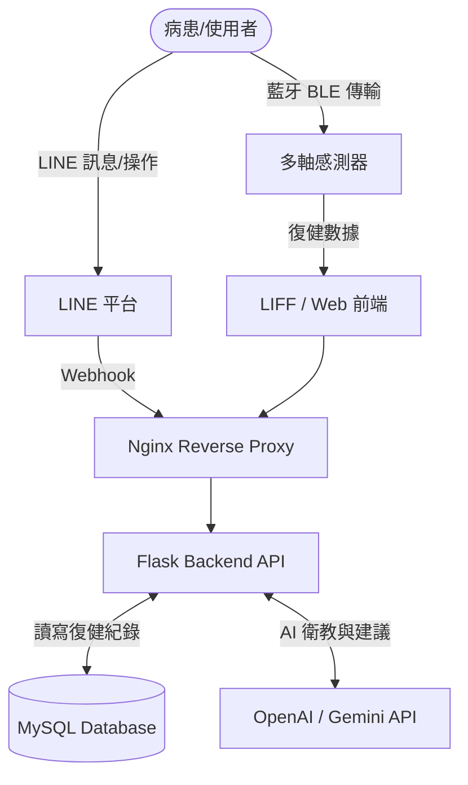

# 順手系統 (Hodo System) - 五十肩智慧復健管理平台

這是一個針對五十肩（Frozen Shoulder）患者開發的智慧復健管理系統，結合了 LINE Bot、LLM AI 輔助、藍牙（BLE）多軸感測器以及網頁管理後台，旨在提供患者居家復健的指引與數據追蹤。

## 🌟 專案特色

- **LINE Bot 互動介面**：提供患者最熟悉的介面，進行每日復健提醒、進度回報與簡單問答。
- **AI 智能輔助 (LLM)**：整合 OpenAI / Gemini 等大型語言模型，提供個人化的復健建議與衛教資訊。
- **BLE 藍牙感測整合**：透過多軸感測器收集患者復健動作的角度與數據，確保動作確實。
- **整合管理後台**：透過 Flask/Python 與 MySQL，提供醫師或復健師檢視病患復健狀況的平台。
- **Docker 容器化部署**：使用 Docker 與 Docker Compose 進行快速部署，並透過 Nginx 進行反向代理。

## 🚀 技術架構

- **Backend / API**: Python, Flask
- **Frontend**: HTML5, Vanilla JS, CSS
- **Database**: MySQL (支援 SSH Tunnel 安全連線)
- **Infrastructure**: Docker, docker-compose, Nginx
- **Third-party Services**: LINE Messaging API, OpenAI API / Gemini API

### 📊 系統架構圖


## ⚙️ 快速啟動

### 1. 環境準備
請確保您的開發環境已安裝以下工具：
- Python 3.9+
- Docker & Docker Compose (若需完整部署)
- Git

### 2. 安裝依賴
```bash
git clone https://github.com/yourusername/hodo_system.git
cd hodo_system
python -m venv venv
source venv/Scripts/activate  # Windows 環境
pip install -r requirements.txt
```

### 3. 環境變數設定
複製範例環境變數檔並填入您的憑證：
```bash
cp .env.example .env
```
請在 `.env` 中設定您的 LINE Bot 憑證、資料庫連線資訊與 API Key。

### 4. 啟動系統
- **入口網頁 (Portal)**
  ```bash
  python app.py
  ```
- **完整容器化服務**
  ```bash
  docker-compose up -d
  ```

## 📁 分支說明 (開發歷程)
- `main` — 穩定版本
- `dev` — 整合測試
- `jimmy` — 後端 API
- `kasa` — 前端
- `ivan` — 多軸感測
- `leon` — BLE + Docker
- `ken` — LINE Bot + LLM

---
*此專案為開發展示用途之開源版本。*
